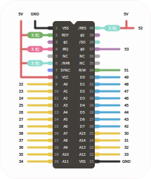

# Mega6502 [![Badge License]][License]

*An experimental implementation of a minimal*  
*8 - bit platform using an **Arduino** + **6502** chip.*

 

## Hardware

The **Mega6502** requires:

 **1 x** `Ardunio Mega 2560` development board 
  
 **1 x** `CMOS 65c02`

 

### Connections

The **65c02** should be connected to the **Arduino** as follows:

 

<!----------------------------------------------------------------------------->

[Badge License]: https://img.shields.io/badge/License-MIT-yellow.svg?style=for-the-badge

[License]: LICENSE